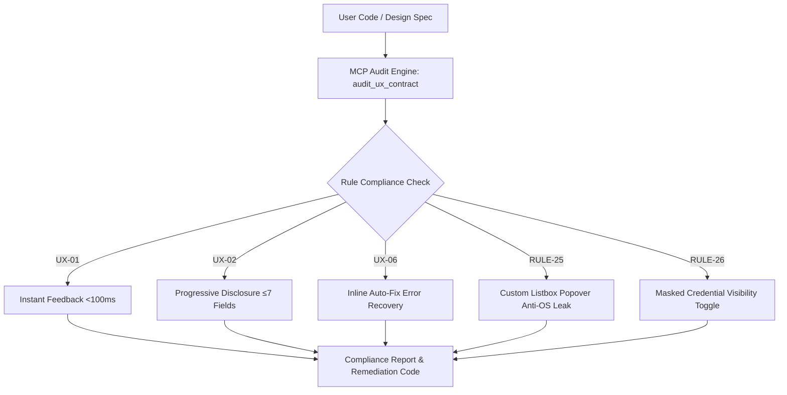

# UX Contract System & MCP Server (`ux-contract-mcp`) 🚀

> **Deterministic UX Quality Gates, Behavioral Psychology Laws, and Model Context Protocol (MCP) Server for AI-Driven Product Engineering.**

[](https://modelcontextprotocol.io)
[](https://github.com/originsatyam/ux-contract-mcp)
[](https://www.w3.org/WAI/standards-guidelines/wcag/)
[](LICENSE)

---

## 📌 Executive Overview

The **UX Contract System (`ux-contract-mcp`)** codifies world-class behavioral psychology research, micro-interaction heuristics, and real-world teardowns into **deterministic quality gates** and an **open-source Model Context Protocol (MCP) Server**.

Designed for **Principal Product Designers**, **Lead Frontend Engineers**, and **Autonomous AI Agents** (Cursor, Windsurf, Claude Desktop, Antigravity), this repository guarantees zero design drift, sub-100ms micro-feedback loops, WCAG AAA accessibility, and ethical symmetrical user experiences.

---

## 🌟 Key Features

- 🧠 **Behavioral Psychology Laws**: Integrated Peak-End Rule, Hick-Hyman Law, Progressive Disclosure, and Loss Aversion item swapping.
- ⚡ **Native MCP Server (`ux-contract-mcp`)**: Model Context Protocol server exposing `audit_ux_contract`, `get_ux_heuristics`, and `get_contract_rules` tools to any AI assistant.
- 🛡️ **Executable UX Contracts**: Formal rules (`UX-01` through `UX-07`, Rules 1–34) covering zero-reflow inputs, single clean focus boundaries, custom listbox popovers, and secret visibility agency.
- 🎯 **Agent Skill Integration**: Direct compatibility with `.agents/skills/ux-audit/SKILL.md` for zero-configuration AI agent discovery.

---

## 🛠️ MCP Integration Guide

Connect this system directly to your AI editor (**Cursor**, **Windsurf**, **Claude Desktop**, or **Antigravity**) via stdio MCP configuration.

### Global / Local MCP Configuration (`mcp_config.json`)

```json
{
  "mcpServers": {
    "ux-contract": {
      "command": "npx",
      "args": [
        "-y",
        "github:originsatyam/ux-contract-mcp"
      ]
    }
  }
}
```

### Available MCP Tools

| Tool Name | Parameters | Description |
| :--- | :--- | :--- |
| `audit_ux_contract` | `code`, `component_type` | Audits HTML/CSS/JS markup against all 34 UX contract rules and returns compliance score, severity, and remediation code. |
| `get_ux_heuristics` | *None* | Retrieves core behavioral psychology laws (progressive disclosure, TTFV, peak-end rule, optimistic UI, loss aversion). |
| `get_contract_rules` | `category` | Retrieves compiled deterministic design contracts and quality gate rules. |

---

## 📐 Architecture & Rule Matrix



### Core Executable Contracts

- **`UX-01` Instant Feedback (<100ms)**: Interactive controls must acknowledge visual feedback instantly upon click/tap.
- **`UX-02` Progressive Disclosure & Live Previews**: Views must not expose >7 primary inputs at once without collapsible drawers or dynamic live previews.
- **`UX-03` Optimistic UI & Error Resilience**: Perform local state updates immediately; revert gracefully with inline error notifications on network failure.
- **`UX-04` Celebration Calibration**: Confetti animations and badges trigger strictly on major milestone completions. Onboarding tooltips auto-hide on target action.
- **`UX-05` Non-Disruptive Validation**: Validate inputs on `blur` or after a 500ms debounce during typing.
- **`UX-06` Inline Auto-Fix**: Error text displays inline adjacent to the field with single-click auto-fix suggestions (e.g., *"Did you mean .com?"*).
- **`UX-07` Symmetrical Ethical UX**: Cancellation and reset paths must match the step depth and visual clarity of creation flows.

---

## 📁 Repository Structure

```
.
├── .agents/
│   └── skills/
│       └── ux-audit/
│           └── SKILL.md        # AI Agent Skill Definition
├── contract/
│   ├── audit.md                # Quality Gate Verification Checklist
│   ├── core.md                 # Design Tokens & System Contract (Rules 1-34)
│   ├── data.md                 # Data Grid & Table Rules
│   ├── forms.md                # Form Ergonomics & Validation Rules
│   ├── insights.md             # Root Cause Analysis & Scenario Audit Ledger
│   ├── overlays.md             # Modal & Drawer Architecture Rules
│   └── ux.md                   # Dedicated UX & Behavioral Contract (UX-01 - UX-07)
├── design-skills/
│   ├── ux-skills.md            # UX & Behavioral Psychology Guide
│   ├── web-skills.md           # Core Web Design Token Guide
│   ├── shadcn-skills.md        # Shadcn Design System Tokens
│   └── carbon-skills.md        # IBM Carbon Design Tokens
├── demo/
│   └── index.html              # Interactive Verified Prototype
├── ux-contract-mcp/
│   ├── index.js                # Model Context Protocol (MCP) Server Implementation
│   └── package.json            # Node.js MCP Package Configuration
└── README.md                   # System Architecture & Documentation
```

---

## 👤 Author & License

- **Creator**: [originsatyam](https://github.com/originsatyam)
- **License**: MIT
